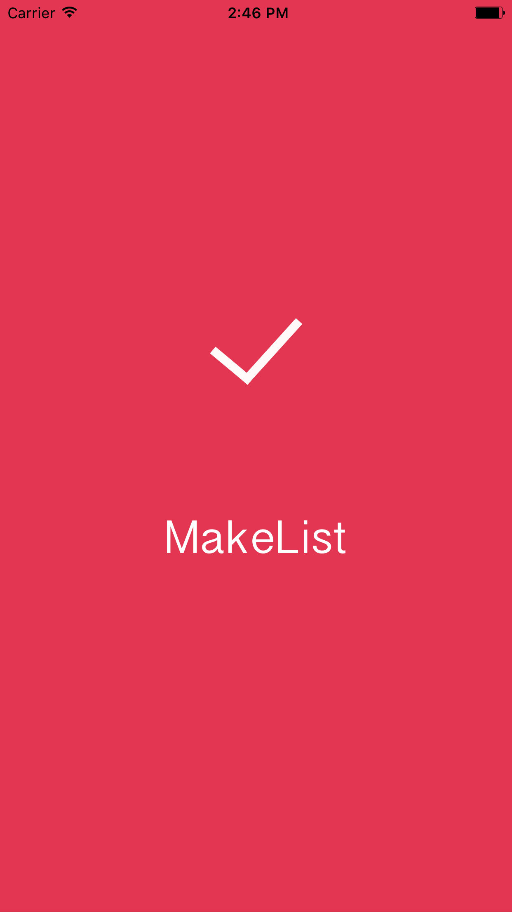
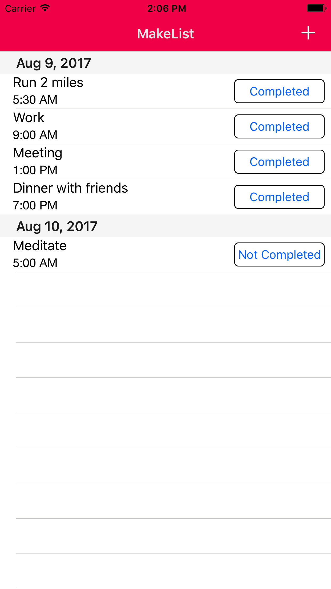
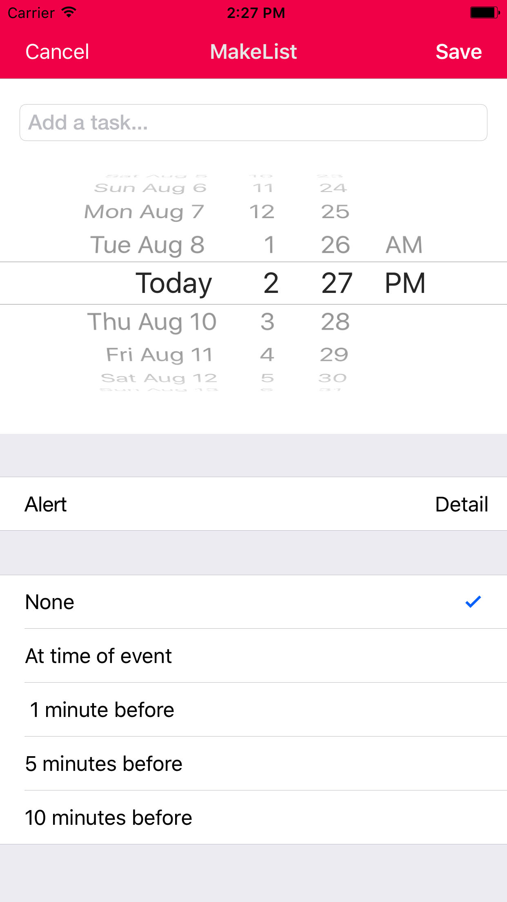

## MakeList
MakeList is a to-do-list app for the iphone that allows you to create a list of your daily activities and it helps you stay on track.The app provides you with user friendly tools such as creating a task with data, time, and an alert to remind you.

  

    

          
    

    

         
    

    

         
    

  

### MakeList Features
- Create a list of tasks
- Set an alert
- Finish off your task by using the completion button

